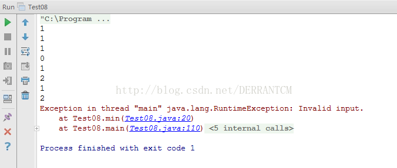

#面试题 8:旋转数组的最小数字

##题目： 把一个数组最开始的若干个元素搬到数组的末尾， 我们称之数组的旋转。输入一个递增排序的数组的一个旋转， 输出旋转数组的最小元素。例如数组{3，4, 5, 1, 2 ｝为｛ l1,2,3, 4，5}的一个旋转，该数组的最小值为 1。

###实现代码如下：

```
[java] view plaincopyprint?
public class Test08 {    
    /** 
     * 把一个数组最开始的若干个元素搬到数组的末尾， 我们称之数组的旋转。 
     * 输入一个递增排序的数组的一个旋转，输出旋转数组的最小元素。 
     * 例如数组{3, 4, 5, 1, 2｝为｛l ,2, 3, 4, 5}的一个旋转，该数组的最小值为 
     * 
     * @param numbers 旋转数组 
     * @return 数组的最小值 
     */  
    public static int min(int[] numbers) {  
        // 判断输入是否合法  
        if (numbers == null || numbers.length == 0) {  
            throw new RuntimeException("Invalid input.");  
        }  
        // 开始处理的第一个位置  
        int lo = 0;  
        // 开始处理的最后一个位置  
        int hi = numbers.length - 1;  
        // 设置初始值  
        int mi = lo;  
        // 确保lo在前一个排好序的部分，hi在排好序的后一个部分  
        while (numbers[lo] >= numbers[hi]) {  
            // 当处理范围只有两个数据时，返回后一个结果  
            // 因为numbers[lo] >= numbers[hi]总是成立，后一个结果对应的是最小的值  
            if (hi - lo == 1) {  
                return numbers[hi];  
            }  
            // 取中间的位置  
            mi = lo + (hi - lo) / 2;  
            // 如果三个数都相等，则需要进行顺序处理，从头到尾找最小的值  
            if (numbers[mi] == numbers[lo] && numbers[hi] == numbers[mi]) {  
                return minInorder(numbers, lo, hi);  
            }  
            // 如果中间位置对应的值在前一个排好序的部分，将lo设置为新的处理位置  
            if (numbers[mi] >= numbers[lo]) {  
                lo = mi;  
            }  
            // 如果中间位置对应的值在后一个排好序的部分，将hi设置为新的处理位置  
            else if (numbers[mi] <= numbers[hi]) {  
                hi = mi;  
            }  
        }  
        // 返回最终的处理结果  
        return numbers[mi];  
    }  
    /** 
     * 找数组中的最小值 
     * 
     * @param numbers 数组 
     * @param start   数组的起始位置 
     * @param end     数组的结束位置 
     * @return 找到的最小的数 
     */  
    public static int minInorder(int[] numbers, int start, int end) {  
        int result = numbers[start];  
        for (int i = start + 1; i <= end; i++) {  
            if (result > numbers[i]) {  
                result = numbers[i];  
            }  
        }  
        return result;  
    }  
    public static void main(String[] args) {  
        // 典型输入，单调升序的数组的一个旋转  
        int[] array1 = {3, 4, 5, 1, 2};  
        System.out.println(min(array1));  
        // 有重复数字，并且重复的数字刚好的最小的数字  
        int[] array2 = {3, 4, 5, 1, 1, 2};  
        System.out.println(min(array2));  
        // 有重复数字，但重复的数字不是第一个数字和最后一个数字  
        int[] array3 = {3, 4, 5, 1, 2, 2};  
        System.out.println(min(array3));  
        // 有重复的数字，并且重复的数字刚好是第一个数字和最后一个数字  
        int[] array4 = {1, 0, 1, 1, 1};  
        System.out.println(min(array4));  
        // 单调升序数组，旋转0个元素，也就是单调升序数组本身  
        int[] array5 = {1, 2, 3, 4, 5};  
        System.out.println(min(array5));  
        // 数组中只有一个数字  
        int[] array6 = {2};  
        System.out.println(min(array6));  
        // 数组中数字都相同  
        int[] array7 = {1, 1, 1, 1, 1, 1, 1};  
        System.out.println(min(array7));  
        System.out.println(min(array6));  
        // 输入NULL  
        System.out.println(min(null));  
    }  
}  
```

###运行结果：

