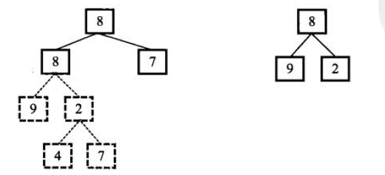
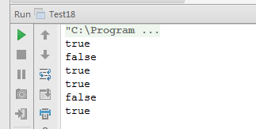

# 树的子结构

## 题目：输入两棵二叉树 A 和 B，判断 B 是不是 A 的子结构。

### 二叉树结点的定义：

```
/**
 * 二叉树的树结点
 */
 public static class BinaryTreeNode {
    int value;
    BinaryTreeNode left;
    BinaryTreeNode right;
}
```

### 解题思路：

要查找树 A 中是否存在和树 B 结构一样的子树，我们可以分成两步： 第一步在树 A 中找到和 B 的根结点的值一样的结点 R， 第二步再判断树 A 中以 R 为根结点的子树是不是包含和树 B 一样的结构。

### 代码实现

```
public class Test18 {
    /**
     * 二叉树的树结点
     */
    public static class BinaryTreeNode {
        int value;
        BinaryTreeNode left;
        BinaryTreeNode right;
    }
    /**
     * 输入两棵二叉树A和B，判断B是不是A的子结构。
     * 该方法是在A树中找到一个与B树的根节点相等的元素的结点，
     * 从这个相等的结点开始判断树B是不是树A的子结构，如果找到其的一个就返回，
     * 否则直到所有的结点都找完为止。
     *
     * @param root1 树A的根结点
     * @param root2 树B的根结点
     * @return true：树B是树A的子结构，false：树B是不树A的子结构
     */
    public static boolean hasSubtree(BinaryTreeNode root1, BinaryTreeNode root2) {
        // 只要两个对象是同一个就返回true
        // 【注意此处与书本上的不同，书本上的没有这一步】
        if (root1 == root2) {
            return true;
        }
        // 只要树B的根结点点为空就返回true
        if (root2 == null) {
            return true;
        }
        // 树B的根结点不为空，如果树A的根结点为空就返回false
        if (root1 == null) {
            return false;
        }
        // 记录匹配结果
        boolean result = false;
        // 如果结点的值相等就，调用匹配方法
        if (root1.value == root2.value) {
            result = match(root1, root2);
        }
        // 如果匹配就直接返回结果
        if (result) {
            return true;
        }
        // 如果不匹配就找树A的左子结点和右子结点进行判断
        return hasSubtree(root1.left, root2) || hasSubtree(root1.right, root2);
    }
    /**
     * 从树A根结点root1和树B根结点root2开始，一个一个元素进行判断，判断B是不是A的子结构
     *
     * @param root1 树A开始匹配的根结点
     * @param root2 树B开始匹配的根结点
     * @return 树B是树A的子结构，false：树B是不树A的子结构
     */
    public static boolean match(BinaryTreeNode root1, BinaryTreeNode root2) {
        // 只要两个对象是同一个就返回true
        if (root1 == root2) {
            return true;
        }
        // 只要树B的根结点点为空就返回true
        if (root2 == null) {
            return true;
        }
        // 树B的根结点不为空，如果树A的根结点为空就返回false
        if (root1 == null) {
            return false;
        }
        // 如果两个结点的值相等，则分别判断其左子结点和右子结点
        if (root1.value == root2.value) {
            return match(root1.left, root2.left) && match(root1.right, root2.right);
        }
        // 结点值不相等返回false
        return false;
    }
    public static void main(String[] args) {
        BinaryTreeNode root1 = new BinaryTreeNode();
        root1.value = 8;
        root1.right = new BinaryTreeNode();
        root1.right.value = 7;
        root1.left = new BinaryTreeNode();
        root1.left.value = 8;
        root1.left.left = new BinaryTreeNode();
        root1.left.left.value = 9;
        root1.left.right = new BinaryTreeNode();
        root1.left.right.value = 2;
        root1.left.right.left = new BinaryTreeNode();
        root1.left.right.left.left = new BinaryTreeNode();
        root1.left.right.left.left.value = 4;
        root1.left.right.left.right = new BinaryTreeNode();
        root1.left.right.left.right.value = 7;
        BinaryTreeNode root2 = new BinaryTreeNode();
        root2.value = 8;
        root2.left = new BinaryTreeNode();
        root2.left.value = 9;
        root2.right = new BinaryTreeNode();
        root2.right.value = 2;
        System.out.println(hasSubtree(root1, root2));
        System.out.println(hasSubtree(root2, root1));
        System.out.println(hasSubtree(root1, root1.left));
        System.out.println(hasSubtree(root1, null));
        System.out.println(hasSubtree(null, root2));
        System.out.println(hasSubtree(null, null));
    }
}
```

### 运行结果

输入的树：



输出结果：

