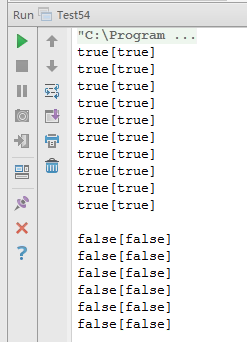

# 面试题 54：表示数值的字符串

##题目：请实现一个函数用来判断字符串是否表示数值（包括整数和小数）。

###例子说明

例如，字符串“+100”，“5e2”，“-123”，“3.1416”及”-1E-16”都表示数值，但“12e”,”1a3.14”,”1.2.3”,”+-5”及“12e+5.4”都不是。 
　　
###解题思路

在数值之前可能有一个表示正负的’-‘或者’+’。接下来是若干个 0 到 9 的数位表示数值的整数部分（在某些小数里可能没有数值的整数部分）。如果数值是一个小数，那么在小数点后面可能会有若干个 0 到 9 的数位表示数值的小数部分。如果数值用科学计数法表示，接下来是一个’e’或者‘E’，以及紧跟着的一个整数（可以有正负号）表示指数。 

判断一个字符串是否符合上述模式时，首先看第一个字符是不是正负号。如果是，在字符串上移动一个字符，继续扫描剩余的字符串中 0 到 9 的数位。如果是一个小数，则将遇到小数点。另外，如果是用科学计数法表示的数值，在整数或者小数的后面还有可能遇到’e’或者’E’。

###代码实现

```
public class Test54 {
    /**
     * 题目：请实现一个函数用来判断字符串是否表示数值（包括整数和小数）。
     *
     * @param string
     * @return
     */
    public static boolean isNumeric(String string) {
        if (string == null || string.length() < 1) {
            return false;
        }
        int index = 0;
        if (string.charAt(index) == '+' || string.charAt(index) == '-') {
            index++;
        }
        // 已经到达字符串的末尾了
        if (index >= string.length()) {
            return false;
        }
        boolean numeric = true;
        index = scanDigits(string, index);
        // 还未到字符串的末尾
        if (index < string.length()) {
            // 如果是小数点
            if (string.charAt(index) == '.') {
                // 移动到下一个位置
                index++;
                index = scanDigits(string, index);
                // 已经到了字符串的末尾了
                if (index >= string.length()) {
                    numeric = true;
                }
                // 还未到字符串结束位置
                else if (index < string.length() && (string.charAt(index) == 'e' || string.charAt(index) == 'E')) {
                    numeric = isExponential(string, index);
                } else {
                    numeric = false;
                }
            }
            // 如果是指数标识
            else if (string.charAt(index) == 'e' || string.charAt(index) == 'E') {
                numeric = isExponential(string, index);
            } else {
                numeric = false;
            }
            return numeric;
        }
        // 已经到了字符串的末尾了，说明其没有指数部分
        else {
            return true;
        }
    }
    /**
     * 判断是否是科学计数法的结尾部分，如E5，e5，E+5，e-5，e(E)后面接整数
     *
     * @param string 字符串
     * @param index  开始匹配的位置
     * @return 匹配的结果
     */
    private static boolean isExponential(String string, int index) {
        if (index >= string.length() || (string.charAt(index) != 'e' && string.charAt(index) != 'E')) {
            return false;
        }
        // 移动到下一个要处理的位置
        index++;
        // 到达字符串的末尾，就返回false
        if (index >= string.length()) {
            return false;
        }
        if (string.charAt(index) == '+' || string.charAt(index) == '-') {
            index++;
        }
        // 到达字符串的末尾，就返回false
        if (index >= string.length()) {
            return false;
        }
        index = scanDigits(string, index);
        // 如果已经处理到了的数字的末尾就认为是正确的指数
        return index >= string.length();
    }
    /**
     * 扫描字符串部分的数字部分
     *
     * @param string 字符串
     * @param index  开始扫描的位置
     * @return 从扫描位置开始第一个数字字符的位置
     */
    private static int scanDigits(String string, int index) {
        while (index < string.length() && string.charAt(index) >= '0' && string.charAt(index) <= '9') {
            index++;
        }
        return index;
    }
    public static void main(String[] args) {
        System.out.println(isNumeric("100") + "[" + true + "]");
        System.out.println(isNumeric("123.45e+6") + "[" + true + "]");
        System.out.println(isNumeric("+500") + "[" + true + "]");
        System.out.println(isNumeric("5e2") + "[" + true + "]");
        System.out.println(isNumeric("3.1416") + "[" + true + "]");
        System.out.println(isNumeric("600.") + "[" + true + "]");
        System.out.println(isNumeric("-.123") + "[" + true + "]");
        System.out.println(isNumeric("-1E-16") + "[" + true + "]");
        System.out.println(isNumeric("100") + "[" + true + "]");
        System.out.println(isNumeric("1.79769313486232E+308") + "[" + true + "]");
        System.out.println();
        System.out.println(isNumeric("12e") + "[" + false + "]");
        System.out.println(isNumeric("1a3.14") + "[" + false + "]");
        System.out.println(isNumeric("1+23") + "[" + false + "]");
        System.out.println(isNumeric("1.2.3") + "[" + false + "]");
        System.out.println(isNumeric("+-5") + "[" + false + "]");
        System.out.println(isNumeric("12e+5.4") + "[" + false + "]");
    }
}
```

运行结果

