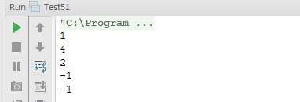

# 数组中重复的数字

## 题目：在一个长度为n的数组里的所有数字都在 0 到 n-1 的范围内。数组中某些数字是重复的，但不知道有几个数字重复了，也不知道每个数字重复了几次。请找出数组中任意一个重复的数字。

### 举例说明

例如，如果输入长度为7的数组{2,3,1,0,2,5,3}，那么对应的输出是重复的数字 2 或者 3。

### 题目分析

解决这个问题的一个简单的方法是先把输入的数组排序。从排序的数组中找出重复的数字时间很容易的事情，只需要从头到尾扫描排序后的数组就可以了。排序一个长度为 n 的数组需要 O(nlogn)的时间。 

还可以利用哈希表来解决这个问题。从头到尾按顺序扫描数组的每个数，每扫描一个数字的时候，都可以用 O(1)的时间来判断哈希表里是否已经包含了该数字。如果哈希表里还没有这个数字，就把它加入到哈希表里。如果哈希表里已经存在该数字了，那么就找到一个重复的数字。这个算法的时间复杂度是 O(n)，但它提高时间效率是以一个大小为 O(n)的哈希表为代价的。我们再看看有没有空间复杂度为 O(1)的算法。
 
我们注意到数组中的数字都在 0 到 n-1 中。如果这个数组中没有重复的数字，那么当数组排序之后数字 i 将出现在下标为 i 的位置。由于数组中有重复的数字，有些位置可能存在多个数字，同时有些位置可能没有数字。 

现在让我们重排这个数组，依然从头到尾一次扫描这个数组中的每个数字。当扫描到下标为 i 的数字时，首先比较这个数字（用 m 表示）是不是等于 i。如果是，接着扫描下一个数字。如果不是，再拿它和第 m 个数字进行比较。 如果它和第m个数字相等，就找到了一个重复的数字（该数字在下标为 i 和 m 的位置都出现了）。如果它和第 m 个数字不相等，就把第 i 个数字和第 m 个数字交换，把 m 放到属于它的位置。接下来再重读这个比较、交换的过程，直到我们发现一个重复的数字。 

以数组{2,3,1,0,2,5,3}为例来分析找到重复数字的步骤。数组的第 0 个数字（从 0 开始计数，和数组的下标保持一致）是 2，与它的下标不相等，于是把它和下标为 2 的数字 1 交换。交换之后的数组是{1.3.2.0.2.5.3}。此时第 0 个数字是 1，仍然与它的下标不相等，继续把它和下标为 1 的数字 3 交换，得到数组{3,1,2,0,2,5,3}.接下来继续交换第 0 个数字 3 和第 3 个数字 0，得到数组{0,1,2,3,2,5,3}。此时第 0 个数字的数值为 0，接着扫描下一个数字。在接下来的几个数字中，下标为 1，2，3 的三个数字分别为 1，2，3 它们的下标和数值都分别相等，因此不需要做任何操作。接下来扫描到下标为 4 的数字 2。由于它的数值与它的下标不相等，再比较它和下标为 2 的数字。注意到此时数组中下标为 2 的数字也是 2，也就是数字在下标为 2 和下标为 4 的两个位置都出现了，因此找到一个重复的数字。

### 代码实现

```
public class Test51 {
    /**
     * 题目：在一个长度为n的数组里的所有数字都在0到n-1的范围内。数组中某些数字是重复的，
     * 但不知道有几个数字重复了，也不知道每个数字重复了几次。请找出数组中任意一个重复的数字。
     * 例如，如果输入长度为7的数组{2,3,1,0,2,5,3}，那么对应的输出是重复的数字2或者。
     *
     * @param number
     * @return
     */
    public static int duplicate(int[] number) {
        if (number == null || number.length < 1) {
            return -1;
        }
        // 判断输入的是否在[0, number.length-1]之间
        for (int i : number) {
            if (i < 0 || i >= number.length) {
                return -1;
            }
        }
        for (int i = 0; i < number.length; i++) {
            // 当number[i]与i不相同的时候一直交换
            while (number[i] != i) {
                // 如果i位置与number[i]位置的数字相同，说明有重复数字
                if (number[i] == number[number[i]]) {
                    return number[i];
                }
                // 如果不同就交换
                else {
                    swap(number, i, number[i]);
                }
            }
        }
        return -1;
    }
    private static void swap(int[] data, int x, int y) {
        int tmp = data[x];
        data[x] = data[y];
        data[y] = tmp;
    }
    public static void main(String[] args) {
        int[] numbers1 = {2, 1, 3, 1, 4};
        System.out.println(duplicate(numbers1));
        int[] numbers2 = {2, 4, 3, 1, 4};
        System.out.println(duplicate(numbers2));
        int[] numbers3 = {2, 4, 2, 1, 4};
        System.out.println(duplicate(numbers3));
        int[] numbers4 = {2, 1, 3, 0, 4};
        System.out.println(duplicate(numbers4));
        int[] numbers5 = {2, 1, 3, 5, 4};
        System.out.println(duplicate(numbers5));
    }
}
```

### 运行结果

