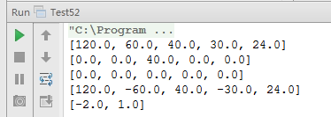

# 面试题 52：构建乘积数组

##题目：给定一个数组 A[0,1,…,n-1]，请构建一个数组 B[0,1,…,n-1]，其中 B 中的元素 B[i]=A[0]×A[1]×…×A[i-1]×A[i+1]×…×A[n-1]，不能使用除法。

###解题思路

例如：

A[]={1,2,3}求B[] 

B[0]=A[1]×A[2]=2×3=6 

B[1]=A[0]×A[2]=1×3=3 

B[2]=A[0]×A[1]=1×2=2


1. B[0]初始化为 1，从下标 i=1 开始，先求出 C[i]的值并放入 B[i],即 B[i]=C[i]=C[i-1]×A[i-1]，所以 B[1]=B[1-1]×A[1-1]=B[0]×A[0]=1×1=1，i++
2. B[2]=B[2-1]×A[2-1]=B[1]×A[1]=1×2=2，i++超出长度停止循环
3. C[i]计算完毕求 D[i],设置一个临时变量 temp 初始化为 1
4. 从后往前变量数组，LengthA=3 初始化 i=LengthA-2=1，结束条件为 i>=0
5. 第一次循环，temp=temp×A[i+1]=1×A[2]=3，计算出A中最后一个元素的值放入 temp，temp 相当于 D[i]的值
6. 因为之前的 B[i]=C[i]，所以让 B[i]×D[i] 就是要保存的结果，即 B[i]=B[1]=B[1]×temp=1×3=3,i–=0
7. 计算 B[i]=B[0]，temp上一步中的值是A[2]，在这次循环中 temp=temp×A[0+1]=A[2]×A[1]=3×2=6
8. B[i]=B[0]=B0]×temp=1×6=6，i–<0循 环结束

所以 B 数组为{6,3,2}

###代码实现

```
import java.util.Arrays;
public class Test52 {
    public static double[] multiply(double[] data) {
        if (data == null || data.length < 2) {
            return null;
        }
        double[] result = new double[data.length];
        // result[0]取1
        result[0] = 1;
        for (int i = 1; i < data.length; i++) {
            // 第一步每个result[i]都等于于data[0]*data[1]...data[i-1]
            // 当i=n-1时，此时result[n-1]的结果已经计算出来了【A】
            result[i] = result[i -1] * data[i - 1];
        }
        // tmp保存data[n-1]*data[n-2]...data[i+1]的结果
        double tmp = 1;
        // 第二步求data[n-1]*data[n-2]...data[i+1]
        // 【A】result[n-1]的结果已经计算出来，所以从data.length-2开始操作
        for (int i = data.length - 2; i >= 0; i--) {
            tmp *= data[i + 1];
            result[i] *= tmp;
        }
        return result;
    }
    public static void main(String[] args) {
        double[] array1 = {1, 2, 3, 4, 5};
        System.out.println(Arrays.toString(multiply(array1))); // double expected[] = {120, 60, 40, 30, 24};
        double[] array2 = {1, 2, 0, 4, 5};
        System.out.println(Arrays.toString(multiply(array2))); // double expected[] = {0, 0, 40, 0, 0};
        double[] array3 = {1, 2, 0, 4, 0};
        System.out.println(Arrays.toString(multiply(array3))); // double expected[] = {0, 0, 0, 0, 0};
        double[] array4 = {1, -2, 3, -4, 5};
        System.out.println(Arrays.toString(multiply(array4))); // double expected[] = {120, -60, 40, -30, 24};
        double[] array5 = {1, -2};
        System.out.println(Arrays.toString(multiply(array5))); // double expected[] = {-2, 1};
    }
}
```


###运行结果

