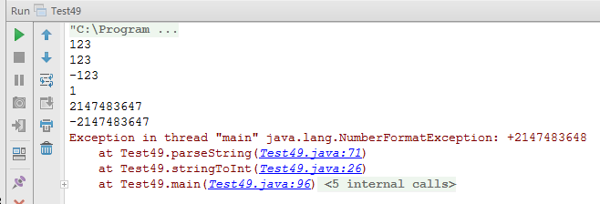

# 面试题 49：把字符串转换成整数

##题目：实现一个函数 stringToInt，实现把字符串转换成整数这个功能，不能使用 atoi 或者其他类似的库函数。

###题目解析

这看起来是很简单的题目，实现基本功能 ，大部分人都能用10行之内的代码解决。可是，当我们要把很多特殊情况即测试用例都考虑进去，却不是件容易的事。解决数值转换问题本身并不难，但我希望在写转换数值的代码之前，应聘者至少能把空指针，空字符串”“，正负号，溢出等方方面面的测试用例都考虑到，并且在写代码的时候对这些特殊的输入都定义好合理的输出。当然，这些输出并不一定要和atoi完全保持一致，但必须要有显式的说明，和面试官沟通好。 

这个应聘者最大的问题就是还没有养成在写代码之前考虑所有可能的测试用例的习惯，逻辑不够严谨，因此一开始的代码只处理了最基本的数值转换。后来我每次提醒他一处特殊的测试用例之后，他改一处代码。尽管他已经做了两次修改，但仍然有不少很明显的漏洞，特殊输入空字符串”“，边界条件比如最大的正整数与最小的负整数等。由于这道题思路本身不难，因此我希望他把问题考虑得极可能周到，代码尽量写完整。

###代码实现

```
public class Test49 {
    /**
     * 题目：实现一个函数stringToInt,实现把字符串转换成整数这个功能，
     * 不能使用atoi或者其他类似的库函数。
     *
     * @param num
     * @return
     */
    public static int stringToInt(String num) {
        if (num == null || num.length() < 1) {
            throw new NumberFormatException(num);
        }
        char first = num.charAt(0);
        if (first == '-') {
            return parseString(num, 1, false);
        } else if (first == '+') {
            return parseString(num, 1, true);
        } else if (first <= '9' && first >= '0') {
            return parseString(num, 0, true);
        } else {
            throw new NumberFormatException(num);
        }
    }
    /**
     * 判断字符是否是数字
     *
     * @param c 字符
     * @return true是，false否
     */
    private static boolean isDigit(char c) {
        return c >= '0' && c <= '9';
    }
    /**
     * 对字符串进行解析
     *
     * @param num      数字串
     * @param index    开始解析的索引
     * @param positive 是正数还是负数
     * @return 返回结果
     */
    private static int parseString(String num, int index, boolean positive) {
        if (index >= num.length()) {
            throw new NumberFormatException(num);
        }
        int result;
        long tmp = 0;
        while (index < num.length() && isDigit(num.charAt(index))) {
            tmp = tmp * 10 + num.charAt(index) - '0';
            // 保证求的得的值不超出整数的最大绝对值
            if (tmp > 0x8000_0000L) {
                throw new NumberFormatException(num);
            }
            index++;
        }
        if (positive) {
            if (tmp >= 0x8000_0000L) {
                throw new NumberFormatException(num);
            } else {
                result = (int) tmp;
            }
        } else {
            if (tmp == 0x8000_0000L) {
                result = 0x8000_0000;
            } else {
                result = (int) -tmp;
            }
        }
        return result;
    }
    public static void main(String[] args) {
//        System.out.println(Integer.parseInt(Integer.MIN_VALUE + ""));
//        System.out.println(0x8000_0000L);
//        System.out.println(stringToInt(""));
        System.out.println(stringToInt("123"));
        System.out.println(stringToInt("+123"));
        System.out.println(stringToInt("-123"));
        System.out.println(stringToInt("1a123"));
        System.out.println(stringToInt("+2147483647"));
        System.out.println(stringToInt("-2147483647"));
        System.out.println(stringToInt("+2147483648"));
        System.out.println(stringToInt("-2147483648"));
//        System.out.println(stringToInt("+2147483649"));
//        System.out.println(stringToInt("-2147483649"));
//        System.out.println(stringToInt("+"));
//        System.out.println(stringToInt("-"));
    }
}
```

###运行结果

