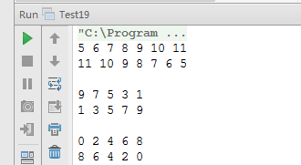

# 二叉树的镜像

## 题目：请完成一个函数，输入一个二叉树，该函数输出它的镜像。

### 二叉树结点的定义：

```
/**
  * 二叉树的树结点
  */
public static class BinaryTreeNode {
    int value;
    BinaryTreeNode left;
    BinaryTreeNode right;
}
```

### 解题思路：

我们先前序遍历这棵树的每个结点，如果遍历到的结点有子结点，就交换它的两个子结点。当交换完所有非叶子结点的左右子结点之后，就得到了树的镜像。

### 代码实现：

```
public class Test19 {
    /**
     * 二叉树的树结点
     */
    public static class BinaryTreeNode {
        int value;
        BinaryTreeNode left;
        BinaryTreeNode right;
    }
    /**
     * 请完成一个函数，输入…个二叉树，该函数输出它的镜像
     *
     * @param node 二叉树的根结点
     */
    public static void mirror(BinaryTreeNode node) {
        // 如果当前结点不为空则进行操作
        if (node != null) {
            // 下面是交换结点左右两个子树
            BinaryTreeNode tmp = node.left;
            node.left = node.right;
            node.right = tmp;
            // 对结点的左右两个子树进行处理
            mirror(node.left);
            mirror(node.right);
        }
    }
    public static void printTree(BinaryTreeNode node) {
        if (node != null) {
            printTree(node.left);
            System.out.print(node.value + " ");
            printTree(node.right);
        }
    }
    public static void main(String[] args) {
        //       8
        //    /    \
        //   6     10
        //  / \   / \
        // 5   7 9  11
        BinaryTreeNode root = new BinaryTreeNode();
        root.value = 8;
        root.left = new BinaryTreeNode();
        root.left.value = 6;
        root.left.left = new BinaryTreeNode();
        root.left.left.value = 5;
        root.left.right = new BinaryTreeNode();
        root.left.right.value = 7;
        root.right = new BinaryTreeNode();
        root.right.value = 10;
        root.right.left = new BinaryTreeNode();
        root.right.left.value = 9;
        root.right.right = new BinaryTreeNode();
        root.right.right.value = 11;
        printTree(root);
        System.out.println();
        mirror(root);
        printTree(root);
        //         1
        //        /
        //       3
        //      /
        //     5
        //    /
        //   7
        //  /
        // 9
        BinaryTreeNode root2 = new BinaryTreeNode();
        root2.value = 1;
        root2.left = new BinaryTreeNode();
        root2.left.value = 3;
        root2.left.left = new BinaryTreeNode();
        root2.left.left.value = 5;
        root2.left.left.left = new BinaryTreeNode();
        root2.left.left.left.value = 7;
        root2.left.left.left.left = new BinaryTreeNode();
        root2.left.left.left.left.value = 9;
        System.out.println("\n");
        printTree(root2);
        System.out.println();
        mirror(root2);
        printTree(root2);
        // 0
        //  \
        //   2
        //    \
        //     4
        //      \
        //       6
        //        \
        //         8
        BinaryTreeNode root3 = new BinaryTreeNode();
        root3.value = 0;
        root3.right = new BinaryTreeNode();
        root3.right.value = 2;
        root3.right.right = new BinaryTreeNode();
        root3.right.right.value = 4;
        root3.right.right.right = new BinaryTreeNode();
        root3.right.right.right.value = 6;
        root3.right.right.right.right = new BinaryTreeNode();
        root3.right.right.right.right.value = 8;
        System.out.println("\n");
        printTree(root3);
        System.out.println();
        mirror(root3);
        printTree(root3);
    }
}
```

### 运行结果：

