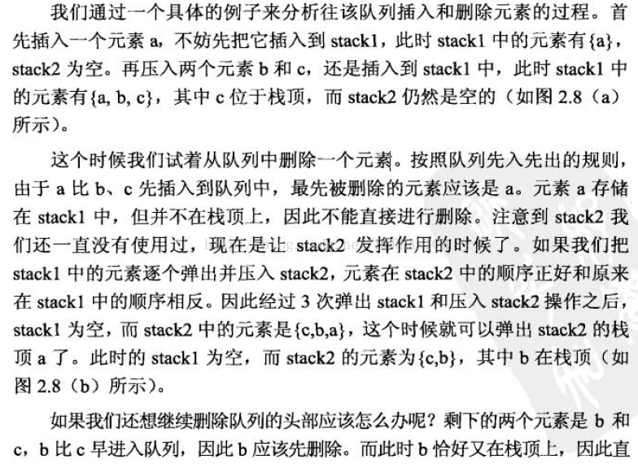

#面试题 7：用两个栈实现队列

##题目：用两个栈实现一个队列。队列的声明如下，请实现它的两个函数appendTail 和deleteHead，分别完成在队列尾部插入结点和在队列头部删除结点的功能。



###代码如下：

```
[java] view plaincopyprint?
public class Test07 {  
    /** 
     * 用两个栈模拟的队列 
     * 用两个核实现一个队列。队列的声明如下，诸实现它的两个函数appendTail和deleteHead， 
     * 分别完成在队列尾部插入结点和在队列头部删除结点的功能。 
     */  
    public static class MList<T> {  
        // 插入栈，只用于插入的数据  
        private Stack<T> stack1 = new Stack<>();  
        // 弹出栈，只用于弹出数据  
        private Stack<T> stack2 = new Stack<>();  
        public MList() {  
        }     
        // 添加操作，成在队列尾部插入结点  
        public void appendTail(T t) {  
            stack1.add(t);  
        }  
        // 删除操作，在队列头部删除结点  
        public T deleteHead() {  
            // 先判断弹出栈是否为空，如果为空就将插入栈的所有数据弹出栈，  
            // 并且将弹出的数据压入弹出栈中  
            if (stack2.isEmpty()) {  
                while (!stack1.isEmpty()) {  
                    stack2.add(stack1.pop());  
                }  
            }  
            // 如果弹出栈中还没有数据就抛出异常  
            if (stack2.isEmpty()) {  
                throw new RuntimeException("No more element.");  
            }  
            // 返回弹出栈的栈顶元素，对应的就是队首元素。  
            return stack2.pop();  
        }  
    }  
}  
```