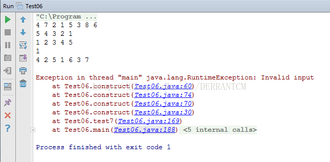

#面试题 6：重建二叉树

##题目：输入某二叉树的前序遍历和中序遍历的结果，请重建出该二叉树。假设输入的前序遍历和中序遍历的结果中都不含重复的数字。例如：前序遍历序列｛ 1， 2， 4，7，3，5，6，8｝和中序遍历序列｛4，7，2，1，5，3，8，6}，重建出下图所示的二叉树并输出它的头结点。


##代码如下：

```
[java] view plaincopyprint?
public class Test06 {  
    /** 
     * 二叉树节点类 
     */  
    public static class BinaryTreeNode {  
        int value;  
        BinaryTreeNode left;  
        BinaryTreeNode right;  
    }  
    /** 
     * 输入某二叉树的前序遍历和中序遍历的结果，请重建出该二节树。假设输入的前序遍历和中序遍历的结果中都不含重复的数字。 
     * 
     * @param preorder 前序遍历 
     * @param inorder  中序遍历 
     * @return 树的根结点 
     */  
    public static BinaryTreeNode construct(int[] preorder, int[] inorder) {  
        // 输入的合法性判断，两个数组都不能为空，并且都有数据，而且数据的数目相同  
        if (preorder == null || inorder == null || preorder.length != inorder.length || inorder.length < 1) {  
            return null;  
        }  
        return construct(preorder, 0, preorder.length - 1, inorder, 0, inorder.length - 1);  
    }  
    /** 
     * 输入某二叉树的前序遍历和中序遍历的结果，请重建出该二节树。假设输入的前序遍历和中序遍历的结果中都不含重复的数字。 
     * 
     * @param preorder 前序遍历 
     * @param ps       前序遍历的开始位置 
     * @param pe       前序遍历的结束位置 
     * @param inorder  中序遍历 
     * @param is       中序遍历的开始位置 
     * @param ie       中序遍历的结束位置 
     * @return 树的根结点 
     */  
    public static BinaryTreeNode construct(int[] preorder, int ps, int pe, int[] inorder, int is, int ie) {  
        // 开始位置大于结束位置说明已经没有需要处理的元素了  
        if (ps > pe) {  
            return null;  
        }  
        // 取前序遍历的第一个数字，就是当前的根结点  
        int value = preorder[ps];  
        int index = is;  
        // 在中序遍历的数组中找根结点的位置  
        while (index <= ie && inorder[index] != value) {  
            index++;  
        }  
        // 如果在整个中序遍历的数组中没有找到，说明输入的参数是不合法的，抛出异常  
        if (index > ie) {  
            throw new RuntimeException("Invalid input");  
        }  
        // 创建当前的根结点，并且为结点赋值  
        BinaryTreeNode node = new BinaryTreeNode();  
        node.value = value;  
        // 递归构建当前根结点的左子树，左子树的元素个数：index-is+1个  
        // 左子树对应的前序遍历的位置在[ps+1, ps+index-is]  
        // 左子树对应的中序遍历的位置在[is, index-1]  
        node.left = construct(preorder, ps + 1, ps + index - is, inorder, is, index - 1);  
        // 递归构建当前根结点的右子树，右子树的元素个数：ie-index个  
        // 右子树对应的前序遍历的位置在[ps+index-is+1, pe]  
        // 右子树对应的中序遍历的位置在[index+1, ie]  
        node.right = construct(preorder, ps + index - is + 1, pe, inorder, index + 1, ie);  
        // 返回创建的根结点  
        return node;  
    }  
    // 中序遍历二叉树  
    public static void printTree(BinaryTreeNode root) {  
        if (root != null) {  
            printTree(root.left);  
            System.out.print(root.value + " ");  
            printTree(root.right);  
        }  
    }  
    // 普通二叉树  
    //              1  
    //           /     \  
    //          2       3  
    //         /       / \  
    //        4       5   6  
    //         \         /  
    //          7       8  
    private static void test1() {  
        int[] preorder = {1, 2, 4, 7, 3, 5, 6, 8};  
        int[] inorder = {4, 7, 2, 1, 5, 3, 8, 6};  
        BinaryTreeNode root = construct(preorder, inorder);  
        printTree(root);  
    }  
    // 所有结点都没有右子结点  
    //            1  
    //           /  
    //          2  
    //         /  
    //        3  
    //       /  
    //      4  
    //     /  
    //    5  
    private static void test2() {  
        int[] preorder = {1, 2, 3, 4, 5};  
        int[] inorder = {5, 4, 3, 2, 1};  
        BinaryTreeNode root = construct(preorder, inorder);  
        printTree(root);  
    }  
    // 所有结点都没有左子结点  
    //            1  
    //             \  
    //              2  
    //               \  
    //                3  
    //                 \  
    //                  4  
    //                   \  
    //                    5  
    private static void test3() {  
        int[] preorder = {1, 2, 3, 4, 5};  
        int[] inorder = {1, 2, 3, 4, 5};  
        BinaryTreeNode root = construct(preorder, inorder);  
        printTree(root);  
    }  
    // 树中只有一个结点  
    private static void test4() {  
        int[] preorder = {1};  
        int[] inorder = {1};  
        BinaryTreeNode root = construct(preorder, inorder);  
        printTree(root);  
    }  
    // 完全二叉树  
    //              1  
    //           /     \  
    //          2       3  
    //         / \     / \  
    //        4   5   6   7  
    private static void test5() {  
        int[] preorder = {1, 2, 4, 5, 3, 6, 7};  
        int[] inorder = {4, 2, 5, 1, 6, 3, 7};  
        BinaryTreeNode root = construct(preorder, inorder);  
        printTree(root);  
    }  
    // 输入空指针  
    private static void test6() {  
        construct(null, null);  
    }  
    // 输入的两个序列不匹配  
    private static void test7() {  
        int[] preorder = {1, 2, 4, 5, 3, 6, 7};  
        int[] inorder = {4, 2, 8, 1, 6, 3, 7};  
        BinaryTreeNode root = construct(preorder, inorder);  
        printTree(root);  
    }  
    public static void main(String[] args) {  
        test1();  
        System.out.println();  
        test2();  
        System.out.println();  
        test3();  
        System.out.println();  
        test4();  
        System.out.println();  
        test5();  
        System.out.println();  
        test6();  
        System.out.println();  
        test7();  
    }  
}  
```

###运行结果：

