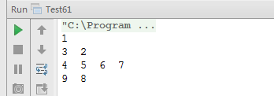

# 按之字形顺序打印二叉树

## 题目：请实现一个函数按照之字形顺序打印二叉树，即第一行按照从左到右的顺序打印，第二层按照从右到左的顺序打印，即第一行按照从左到右的顺序打印，第二层按照从右到左顺序打印，第三行再按照从左到右的顺序打印，其他以此类推。

### 解题思路

按之字形顺序打印二叉树需要两个栈。我们在打印某一行结点时，把下一层的子结点保存到相应的栈里。如果当前打印的是奇数层，则先保存左子结点再保存右子结点到一个栈里；如果当前打印的是偶数层，则先保存右子结点再保存左子结点到第二个栈里。

### 结点定义

```
private static class BinaryTreeNode {
    private int val;
    private BinaryTreeNode left;
    private BinaryTreeNode right;
    public BinaryTreeNode() {
    }
    public BinaryTreeNode(int val) {
        this.val = val;
    }
    @Override
    public String toString() {
        return val + "";
    }
}
```

### 代码实现

```
import java.util.LinkedList;
import java.util.List;
public class Test61 {
    private static class BinaryTreeNode {
        private int val;
        private BinaryTreeNode left;
        private BinaryTreeNode right;
        public BinaryTreeNode() {
        }
        public BinaryTreeNode(int val) {
            this.val = val;
        }
        @Override
        public String toString() {
            return val + "";
        }
    }
    public static void print(BinaryTreeNode root) {
        if (root == null) {
            return;
        }
        List<BinaryTreeNode> current = new LinkedList<>();
        List<BinaryTreeNode> reverse = new LinkedList<>();
        int flag = 0;
        BinaryTreeNode node;
        current.add(root);
        while (current.size() > 0) {
            // 从最后一个开始取
            node = current.remove(current.size() - 1);
            System.out.printf("%-3d", node.val);
            // 当前是从左往右打印的，那就按从左往右入栈
            if (flag == 0) {
                if (node.left != null) {
                    reverse.add(node.left);
                }
                if (node.right != null) {
                    reverse.add(node.right);
                }
            }
            // 当前是从右往左打印的，那就按从右往左入栈
            else {
                if (node.right != null) {
                    reverse.add(node.right);
                }
                if (node.left != null) {
                    reverse.add(node.left);
                }
            }
            if (current.size() == 0) {
                flag = 1 - flag;
                List<BinaryTreeNode> tmp = current;
                current = reverse;
                reverse = tmp;
                System.out.println();
            }
        }
    }
    public static void main(String[] args) {
        BinaryTreeNode n1 = new BinaryTreeNode(1);
        BinaryTreeNode n2 = new BinaryTreeNode(2);
        BinaryTreeNode n3 = new BinaryTreeNode(3);
        BinaryTreeNode n4 = new BinaryTreeNode(4);
        BinaryTreeNode n5 = new BinaryTreeNode(5);
        BinaryTreeNode n6 = new BinaryTreeNode(6);
        BinaryTreeNode n7 = new BinaryTreeNode(7);
        BinaryTreeNode n8 = new BinaryTreeNode(8);
        BinaryTreeNode n9 = new BinaryTreeNode(9);
        n1.left = n2;
        n1.right = n3;
        n2.left = n4;
        n2.right = n5;
        n3.left = n6;
        n3.right = n7;
        n4.left = n8;
        n4.right = n9;
        print(n1);
    }
}
```

### 运行结果


