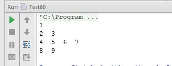

# 把二叉树打印出多行

## 题目：从上到下按层打印二叉树，同一层的结点按从左到右的顺序打印，每一层打印一行。

### 解题思路

用一个队列来保存将要打印的结点。为了把二叉树的每一行单独打印到一行里，我们需要两个变量：一个变量表示在当前的层中还没有打印的结点数，另一个变量表示下一次结点的数目。

### 结点定义

```
private static class BinaryTreeNode {
    private int val;
    private BinaryTreeNode left;
    private BinaryTreeNode right;
    public BinaryTreeNode() {
    }
    public BinaryTreeNode(int val) {
        this.val = val;
    }
    @Override
    public String toString() {
        return val + "";
    }
}
```

### 代码实现

```
import java.util.LinkedList;
import java.util.List;
public class Test60 {
    private static class BinaryTreeNode {
        private int val;
        private BinaryTreeNode left;
        private BinaryTreeNode right;
        public BinaryTreeNode() {
        }
        public BinaryTreeNode(int val) {
            this.val = val;
        }
        @Override
        public String toString() {
            return val + "";
        }
    }
    /**
     * 题目：从上到下按层打印二叉树，同一层的结点按从左到右的顺序打印，每一层打印一行。
     * @param root
     */
    public static void print(BinaryTreeNode root) {
        if (root == null) {
            return;
        }
        List<BinaryTreeNode> list = new LinkedList<>();
        BinaryTreeNode node;
        // 当前层的结点个数
        int current = 1;
        // 记录下一层的结点个数
        int next = 0;
        list.add(root);
        while (list.size() > 0) {
            node = list.remove(0);
            current--;
            System.out.printf("%-3d", node.val);
            if (node.left != null) {
                list.add(node.left);
                next++;
            }
            if (node.right != null) {
                list.add(node.right);
                next++;
            }
            if (current ==0) {
                System.out.println();
                current = next;
                next = 0;
            }
        }
    }
    public static void main(String[] args) {
        BinaryTreeNode n1 = new BinaryTreeNode(1);
        BinaryTreeNode n2 = new BinaryTreeNode(2);
        BinaryTreeNode n3 = new BinaryTreeNode(3);
        BinaryTreeNode n4 = new BinaryTreeNode(4);
        BinaryTreeNode n5 = new BinaryTreeNode(5);
        BinaryTreeNode n6 = new BinaryTreeNode(6);
        BinaryTreeNode n7 = new BinaryTreeNode(7);
        BinaryTreeNode n8 = new BinaryTreeNode(8);
        BinaryTreeNode n9 = new BinaryTreeNode(9);
        n1.left = n2;
        n1.right = n3;
        n2.left = n4;
        n2.right = n5;
        n3.left = n6;
        n3.right = n7;
        n4.left = n8;
        n4.right = n9;
        print(n1);
    }
}
```

### 运行结果


