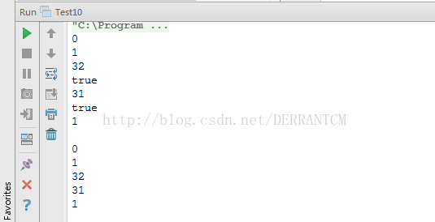

#面试题 10：二进制中 1 的个数 


###代码如下，请在 JDK7 及以上版本运行：

```
[java] view plaincopyprint?
public class Test10 {  
    /** 
     * 请实现一个函数， 输入一个整数，输出该数二进制表示中1的个数。 
     * 例如把9表示成二进制是1001 ，有2位是1. 因此如果输入9，该出2。 
     * 
     * @param n 待的数字 
     * @return 数字中二进制表表的1的数目 
     */  
    public static int numberOfOne(int n) {  
        // 记录数字中1的位数  
        int result = 0;  
        // JAVA语言规范中，int整形占四个字节，总计32位  
        // 对每一个位置与1进行求与操作，再累加就可以求出当前数字的表示是多少位1  
        for (int i = 0; i < 32; i++) {  
            result += (n & 1);  
            n >>>= 1;  
        }  
        // 返回求得的结果  
        return result;  
    }  
    /** 
     * 请实现一个函数， 输入一个整数，输出该数二进制表示中1的个数。 
     * 例如把9表示成二进制是1001 ，有2位是1. 因此如果输入9，该出2。 
     * 【这种方法的效率更高】 
     * 
     * @param n 待的数字 
     * @return 数字中二进制表表的1的数目 
     */  
    public static int numberOfOne2(int n) {  
        // 记录数字中1的位数  
        int result = 0;  
        // 数字的二进制表示中有多少个1就进行多少次操作  
        while (n != 0) {  
            result++;  
            // 从最右边的1开始，每一次操作都使n的最右的一个1变成了0，  
            // 即使是符号位也会进行操作。  
            n = (n - 1) & n;  
        }  
        // 返回求得的结果  
        return result;  
    }  
    public static void main(String[] args) {  
        System.out.println(numberOfOne(0B00000000_00000000_00000000_00000000)); // 0  
        System.out.println(numberOfOne(0B00000000_00000000_00000000_00000001)); // 1  
        System.out.println(numberOfOne(0B11111111_11111111_11111111_11111111)); // -1  
        System.out.println(0B01111111_11111111_11111111_11111111 == Integer.MAX_VALUE);  
        System.out.println(numberOfOne(0B01111111_11111111_11111111_11111111)); // Integer.MAX_VALUE  
        System.out.println(0B10000000_00000000_00000000_00000000 == Integer.MIN_VALUE);  
        System.out.println(numberOfOne(0B10000000_00000000_00000000_00000000)); // Integer.MIN_VALUE  
        System.out.println("");  
        System.out.println(numberOfOne2(0B00000000_00000000_00000000_00000000)); // 0  
        System.out.println(numberOfOne2(0B00000000_00000000_00000000_00000001)); // 1  
        System.out.println(numberOfOne2(0B11111111_11111111_11111111_11111111)); // -1  
        System.out.println(numberOfOne2(0B01111111_11111111_11111111_11111111)); // Integer.MAX_VALUE  
        System.out.println(numberOfOne2(0B10000000_00000000_00000000_00000000)); // Integer.MIN_VALUE  
    }  
}  
```

###运行结果：


