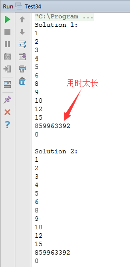

#面试题 34：丑数

##题目：我们把只包含因子 2、3 和 5 的数称作丑数（Ugly Number）。求从小到大的顺序的第 1500个丑数。

###举例说明：

例如 6、8 都是丑数，但 14 不是，它包含因子 7。习惯上我们把 1 当做第一个丑数。

###解题思路：

####第一种：逐个判断每个数字是不是丑数的解法，直观但不够高效。

####第二种：创建数组保存已经找到丑数，用空间换时间的解法。

根据丑数的定义， 丑数应该是另一个丑数乘以 2、3 或者 5 的结果（1 除外）。因此我们可以创建一个数组，里面的数字是排好序的丑数，每一个丑数都是前面的丑数乘以 2、3 或者 5 得到的。

这种思路的关键在于怎样确保数组里面的丑数是排好序的。假设数组中已经有若干个丑数排好序后存放在数组中，并且把己有最大的丑数记做M，我们接下来分析如何生成下一个丑数。该丑数肯定是前面某一个丑数乘以 2、3 或者 5 的结果， 所以我们首先考虑把已有的每个丑数乘以 2。在乘以 2 的时钝能得到若干个小于或等于 M 的结果。由于是按照顺序生成的，小于或者等于 M 肯定己经在数组中了，我们不需再次考虑：还会得到若干个大于 M 的结果，但我们只需要第一个大于 M 的结果，因为我们希望丑数是按从小到大的顺序生成的，其他更大的结果以后再说。我们把得到的第一个乘以 2 后大于 M 的结果记为 M2，同样，我们把已有的每一个丑数乘以 3 和 5，能得到第一个大于 M 的结果 M3 和 M，那么下一个丑数应该是 M2、M3 和 M5 这 3 个数的最小者。

前面分析的时候，提到把已有的每个丑数分别都乘以 2、3 和 5。事实上这不是必须的，因为已有的丑数是按顺序存放在数组中的。对乘以 2 而言， 肯定存在某一个丑数 T2，排在它之前的每一个丑数乘以 2 得到的结果都会小于已有最大的丑数，在它之后的每一个丑数乘以 2 得到的结果都会太大。我们只需记下这个丑数的位置， 同时每次生成新的丑数的时候，去更新这个 T2。对乘以 3 和 5 而言， 也存在着同样的 T3 和 T5。

本题实现了两种方法。

###代码实现：

```
public class Test34 {
    /**
     * 判断一个数是否只有2，3，5因子（丑数）
     *
     * @param num 待判断的数，非负
     * @return true是丑数，false丑数
     */
    private static boolean isUgly(int num) {
        while (num % 2 == 0) {
            num /= 2;
        }
        while (num % 3 == 0) {
            num /= 3;
        }
        while (num % 5 == 0) {
            num /= 5;
        }
        return num == 1;
    }
    /**
     * 找第index个丑数，速度太慢
     *
     * @param index 第index个丑数
     * @return 对应的丑数值
     */
    public static int getUglyNumber(int index) {
        if (index <= 0) {
            return 0;
        }
        int num = 0;
        int uglyFound = 0;
        while (uglyFound < index) {
            num++;
            if (isUgly(num)) {
                ++uglyFound;
            }
        }
        return num;
    }
    /**
     * 找第index个丑数，【第二种方法】
     *
     * @param index 第index个丑数
     * @return 对应的丑数值
     */
    public static int getUglyNumber2(int index) {
        if (index <= 0) {
            return 0;
        }
        int[] pUglyNumbers = new int[index];
        pUglyNumbers[0] = 1;
        int nextUglyIndex = 1;
        int p2 = 0;
        int p3 = 0;
        int p5 = 0;
        while (nextUglyIndex < index) {
            int min = min(pUglyNumbers[p2] * 2, pUglyNumbers[p3] * 3, pUglyNumbers[p5] * 5);
            pUglyNumbers[nextUglyIndex] = min;
            while (pUglyNumbers[p2] * 2 <= pUglyNumbers[nextUglyIndex]) {
                p2++;
            }
            while (pUglyNumbers[p3] * 3 <= pUglyNumbers[nextUglyIndex]) {
                p3++;
            }
            while (pUglyNumbers[p5] * 5 <= pUglyNumbers[nextUglyIndex]) {
                p5++;
            }
            nextUglyIndex++;
        }
        return pUglyNumbers[nextUglyIndex - 1];
    }
    private static int min(int n1, int n2, int n3) {
        int min = n1 < n2 ? n1 : n2;
        return min < n3 ? min : n3;
    }
    public static void main(String[] args) {
        System.out.println("Solution 1:");
        test1();
        System.out.println();
        System.out.println("Solution 2:");
        test2();
    }
    private static void test1() {
        System.out.println(getUglyNumber(1)); // 1
        System.out.println(getUglyNumber(2)); // 2
        System.out.println(getUglyNumber(3)); // 3
        System.out.println(getUglyNumber(4)); // 4
        System.out.println(getUglyNumber(5)); // 5
        System.out.println(getUglyNumber(6)); // 6
        System.out.println(getUglyNumber(7)); // 8
        System.out.println(getUglyNumber(8)); // 9
        System.out.println(getUglyNumber(9)); // 10
        System.out.println(getUglyNumber(10)); // 12
        System.out.println(getUglyNumber(11)); // 15
        System.out.println(getUglyNumber(1500)); // 859963392
        System.out.println(getUglyNumber(0)); // 0
    }
    private static void test2() {
        System.out.println(getUglyNumber2(1)); // 1
        System.out.println(getUglyNumber2(2)); // 2
        System.out.println(getUglyNumber2(3)); // 3
        System.out.println(getUglyNumber2(4)); // 4
        System.out.println(getUglyNumber2(5)); // 5
        System.out.println(getUglyNumber2(6)); // 6
        System.out.println(getUglyNumber2(7)); // 8
        System.out.println(getUglyNumber2(8)); // 9
        System.out.println(getUglyNumber2(9)); // 10
        System.out.println(getUglyNumber2(10)); // 12
        System.out.println(getUglyNumber2(11)); // 15
        System.out.println(getUglyNumber2(1500)); // 859963392
        System.out.println(getUglyNumber2(0)); // 0
    }
}
```

###运行结果：

