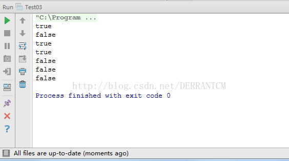

#面试题 3：二维数组中的查找

##题目：在一个二维数组中，每一行都按照从左到右递增的顺序排序，每一列都按照从上到下递增的顺序排序。请完成一个函数，输入这样的一个二维数组和一个整数，判断数组中是否含有该整数。

```
[java] view plaincopyprint?
public class Test03 {  
    /** 
     * 在一个二维数组中，每一行都按照从左到右递增的顺序排序，每一列都按照从上到下递增的顺序排序。 
     * 请完成一个函数，输入这样的一个二维数组和一个整数，判断数组中是否含有该整数。 
     * <p/> 
     * 规律：首先选取数组中右上角的数字。如果该数字等于要查找的数字，查找过程结束： 
     * 如果该数字大于要查找的数字，剔除这个数字所在的列：如果该数字小于要查找的数字，剔除这个数字所在的行。 
     * 也就是说如果要查找的数字不在数组的右上角，则每－次都在数组的查找范围中剔除）行或者一列，这样每一步都可以缩小 
     * 查找的范围，直到找到要查找的数字，或者查找范围为空。 
     * 
     * @param matrix 待查找的数组 
     * @param number 要查找的数 
     * @return 查找结果，true找到，false没有找到 
     */  
    public static boolean find(int[][] matrix, int number) {  
        // 输入条件判断  
        if (matrix == null || matrix.length < 1 || matrix[0].length < 1) {  
            return false;  
        }  
        int rows = matrix.length; // 数组的行数  
        int cols = matrix[1].length; // 数组行的列数  
        int row = 0; // 起始开始的行号  
        int col = cols - 1; // 起始开始的列号  
        // 要查找的位置确保在数组之内  
        while (row >= 0 && row < rows && col >= 0 && col < cols) {  
            if (matrix[row][col] == number) { // 如果找到了就直接退出  
                return true;  
            } else if (matrix[row][col] > number) { // 如果找到的数比要找的数大，说明要找的数在当前数的左边  
                col--; // 列数减一，代表向左移动  
            } else { // 如果找到的数比要找的数小，说明要找的数在当前数的下边  
                row++; // 行数加一，代表向下移动  
            }  
        }  
        return false;  
    }  
    public static void main(String[] args) {  
        int[][] matrix = {  
                {1, 2, 8, 9},  
                {2, 4, 9, 12},  
                {4, 7, 10, 13},  
                {6, 8, 11, 15}  
        };  
        System.out.println(find(matrix, 7));    // 要查找的数在数组中  
        System.out.println(find(matrix, 5));    // 要查找的数不在数组中  
        System.out.println(find(matrix, 1));    // 要查找的数是数组中最小的数字  
        System.out.println(find(matrix, 15));   // 要查找的数是数组中最大的数字  
        System.out.println(find(matrix, 0));    // 要查找的数比数组中最小的数字还小  
        System.out.println(find(matrix, 16));   // 要查找的数比数组中最大的数字还大  
        System.out.println(find(null, 16));     // 健壮性测试，输入空指针  
    }  
}  
```

###运行结果：

