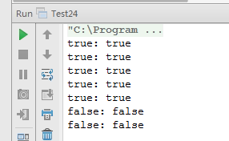

# 二叉搜索树的后序遍历序列

## 题目：输入一个整数数组，判断该数组是不是某二叉搜索树的后序遍历的结果。如果是则返回 true。否则返回 false。假设输入的数组的任意两个数字都互不相同。

### 解题思路：

在后序遍历得到的序列中， 最后一个数字是树的根结点的值。数组中前面的数字可以分为两部分： 第一部分是左子树结点的值，它们都比根结点的值小： 第二部分是右子树结点的值，它们都比根结点的值大。

### 代码实现：

```
public class Test24 {
    /**
     * 输入一个整数数组，判断该数组是不是某二叉搜索树的后序遍历的结果。
     * 如果是则返回true。否则返回false。假设输入的数组的任意两个数字都互不相同。
     *
     * @param sequence 某二叉搜索树的后序遍历的结果
     * @return true：该数组是某二叉搜索树的后序遍历的结果。false：不是
     */
    public static boolean verifySequenceOfBST(int[] sequence) {
        // 输入的数组不能为空，并且有数据
        if (sequence == null || sequence.length <= 0) {
            return false;
        }
        // 有数据，就调用辅助方法
        return verifySequenceOfBST(sequence, 0, sequence.length - 1);
    }
    /**
     * 输入一个整数数组，判断该数组是不是某二叉搜索树的后序遍历的结果。
     * 【此方法与上一个方法不同，未进行空值判断，对于数组度为0的情况返回的true也于上题不同，
     * 此方法只是上面一个方法的辅助实现，对于数数组为null和数组长度为0的情况，执行结果并非相同】
     * 【也就是说此方法只有数组中有数据的情况下才与上面的方法返回同样的结点，
     * verifySequenceOfBST(sequence) ===
     * verifySequenceOfBST(sequence, 0, sequence.length - 1)
     * 当sequence中有数据才成立
     * 】
     *
     * @param sequence 某二叉搜索树的后序遍历的结果
     * @param start    处理的开始位置
     * @param end      处理的结束位置
     * @return true：该数组是某二叉搜索树的后序遍历的结果。false：不是
     */
    public static boolean verifySequenceOfBST(int[] sequence, int start, int end) {
        // 如果对应要处理的数据只有一个或者已经没有数据要处理（start>end）就返回true
        if (start >= end) {
            return true;
        }
        // 从左向右找第一个不大于根结点（sequence[end]）的元素的位置
        int index = start;
        while (index < end - 1 && sequence[index] < sequence[end]) {
            index++;
        }
        // 执行到此处[end, index-1]的元素都是小于根结点的（sequence[end]）
        // [end, index-1]可以看作是根结点的左子树
        // right用于记录第一个不小于根结点的元素的位置
        int right = index;
        // 接下来要保证[index, end-1]的所有元素都是大于根根点的【A】
        // 因为[index, end-1]只有成为根结点的右子树
        // 从第一个不小于根结点的元素开始，找第一个不大于根结点的元素
        while (index < end - 1 && sequence[index] > sequence[end]) {
            index++;
        }
        // 如果【A】条件满足，那么一定有index=end-1，
        // 如果不满足那说明根结点的右子树[index, end-1]中有小于等于根结点的元素，
        // 不符合二叉搜索树的定义，返回false
        if (index != end - 1) {
            return false;
        }
        // 执行到此处说明直到目前为止，还是合法的
        // [start, index-1]为根结点左子树的位置
        // [index, end-1]为根结点右子树的位置
        index = right;
        return verifySequenceOfBST(sequence, start, index - 1) && verifySequenceOfBST(sequence, index, end - 1);
    }
    public static void main(String[] args) {
        //           10
        //         /   \
        //        6     14
        //       /\     /\
        //      4  8  12  16
        int[] data = {4, 8, 6, 12, 16, 14, 10};
        System.out.println("true: " + verifySequenceOfBST(data));
        //           5
        //          / \
        //         4   7
        //            /
        //           6
        int[] data2 = {4, 6, 7, 5};
        System.out.println("true: " + verifySequenceOfBST(data2));
        //               5
        //              /
        //             4
        //            /
        //           3
        //          /
        //         2
        //        /
        //       1
        int[] data3 = {1, 2, 3, 4, 5};
        System.out.println("true: " + verifySequenceOfBST(data3));
        // 1
        //  \
        //   2
        //    \
        //     3
        //      \
        //       4
        //        \
        //         5
        int[] data4 = {5, 4, 3, 2, 1};
        System.out.println("true: " + verifySequenceOfBST(data4));
        // 树中只有1个结点
        int[] data5 = {5};
        System.out.println("true: " + verifySequenceOfBST(data5));
        int[] data6 = {7, 4, 6, 5};
        System.out.println("false: " + verifySequenceOfBST(data6));
        int[] data7 = {4, 6, 12, 8, 16, 14, 10};
        System.out.println("false: " + verifySequenceOfBST(data7));
    }
}
```

### 运行结果：

