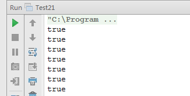

# 包含 min 函数的钱

## 题目： 定义栈的数据结构，请在该类型中实现一个能够得到栈的最小素的 min 函数。在该栈中，调用 min、push 及 pop 的时间复杂度都是 0(1)

### 解题思路：

把每次的最小元素（之前的最小元素和新压入战的元素两者的较小值）都保存起来放到另外一个辅助栈里。

如果每次都把最小元素压入辅助栈， 那么就能保证辅助栈的栈顶一直都是最小元素．当最小元素从数据栈内被弹出之后，同时弹出辅助栈的栈顶元素，此时辅助栈的新栈顶元素就是下一个最小值。

### 代码实现：

```
public class Test21 {
    /**
     * 定义栈的数据结构，请在该类型中实现一个能够得到校的最小元素的min函数。
     * 在该栈中，调用pop、push 及min的时间复杂度都是0(1)
     *
     * @param <T> 泛型参数
     */
    public static class StackWithMin<T extends Comparable<T>> {
        // 数据栈，用于存放插入的数据
        private Stack<T> dataStack;
        // 最小数位置栈，存放数据栈中最小的数的位置
        private Stack<Integer> minStack;
        // 构造函数
        public StackWithMin() {
            this.dataStack = new Stack<>();
            this.minStack = new Stack<>();
        }
        /**
         * 出栈方法
         * @return 栈顶元素
         */
        public T pop() {
            // 如果栈已经为空，再出栈抛出异常
            if (dataStack.isEmpty()) {
                throw new RuntimeException("The stack is already empty");
            }
            // 如果有数据，最小数位置栈和数据栈必定是有相同的元素个数，
            // 两个栈同时出栈
            minStack.pop();
            return dataStack.pop();
        }
        /**
         * 元素入栈
         * @param t 入栈的元素
         */
        public void push(T t) {
            // 如果入栈的元素为空就抛出异常
            if (t == null) {
                throw new RuntimeException("Element can be null");
            }
            // 如果数据栈是空的，只接将元素入栈，同时更新最小数栈中的数据
            if (dataStack.isEmpty()) {
                dataStack.push(t);
                minStack.push(0);
            }
            // 如果数据栈中有数据
            else {
                // 获取数据栈中的最小元素（未插入t之前的）
                T e = dataStack.get(minStack.peek());
                // 将t入栈
                dataStack.push(t);
                // 如果插入的数据比栈中的最小元素小
                if (t.compareTo(e) < 0) {
                    // 将新的最小元素的位置入最小栈
                    minStack.push(dataStack.size() - 1);
                } else {
                    // 插入的元素不比原来的最小元素小，复制最小栈栈顶元素，将其入栈
                    minStack.push(minStack.peek());
                }
            }
        }
        /**
         * 获取栈中的最小元素
         * @return 栈中的最小元素
         */
        public T min() {
            // 如果最小数公位置栈已经为空（数据栈中已经没有数据了），则抛出异常
            if (minStack.isEmpty()) {
                throw new RuntimeException("No element in stack.");
            }
            // 获取数据栈中的最小元素，并且返回结果
            return dataStack.get(minStack.peek());
        }
    }
    public static void main(String[] args) {
        StackWithMin<Integer> stack = new StackWithMin<>();
        stack.push(3);
        System.out.println(stack.min() == 3);
        stack.push(4);
        System.out.println(stack.min() == 3);
        stack.push(2);
        System.out.println(stack.min() == 2);
        stack.push(3);
        System.out.println(stack.min() == 2);
        stack.pop();
        System.out.println(stack.min() == 2);
        stack.pop();
        System.out.println(stack.min() == 3);
        stack.push(0);
        System.out.println(stack.min() == 0);
    }
}
```

### 运行结果：

