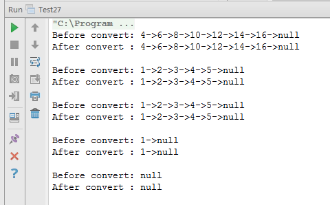

#面试题 27：二叉搜索树与双向链表  

##题目：输入一棵二叉搜索树，将该二叉搜索树转换成一个排序的双向链表。要求不能创建任何新的结点，只能调整树中结点指针的指向。

比如输入图 4.12 中左边的二叉搜索树，则输出转换之后的排序现向链表。


###结点定义：

```
public static class BinaryTreeNode {
    int value;
    BinaryTreeNode left;
    BinaryTreeNode right;
}
```

###解题思路：

在二叉树中，每个结点都有两个指向子结点的指针。在双向链表中，每个结点也有两个指针，它们分别指向前一个结点和后一个结点。由于这两种结点的结构相似，同时二叉搜索树也是一种排序的数据结构，因此在理论上有可能实现二叉搜索树和排序的双向链表的转换。在搜索二叉树中，左子结点的值总是小于父结点的值，右子结点的值总是大于父结点的值。因此我们在转换成排序双向链表时，原先指向左子结点的指针调整为链表中指向前一个结点的指针，原先指向右子结点的指针调整为链表中指向后一个结点指针。接下来我们考虑该如何转换。

由于要求转换之后的链表是排好序的，我们可以中序遍历树中的每一个结点， 这是因为中序遍历算法的特点是按照从小到大的顺序遍历二叉树的每一个结点。当遍历到根结点的时候，我们把树看成三部分：值为 10 的结点、根结点值为 6 的左子树、根结点值为 14 的右子树。根据排序链表的定义，值为 10 的结点将和它的左子树的最大一个结点（即值为 8 的结点）链接起来，同时它还将和右子树最小的结点（即值为 12 的结点）链接起来，如图 4.13 所示。


按照中序遍历的顺序， 当我们遍历转换到根结点（值为 10 的结点）时，它的左子树已经转换成一个排序的链表了， 并且处在链表中的最后一个结点是当前值最大的结点。我们把值为 8 的结点和根结点链接起来，此时链表中的最后一个结点就是 10 了。接着我们去地历转换右子树， 并把根结点和右子树中最小的结点链接起来。至于怎么去转换它的左子树和右子树，由于遍历和转换过程是一样的，我们很自然地想到可以用递归。

###代码实现：

```
public class Test27 {
    /**
     * 二叉树的树结点
     */
    public static class BinaryTreeNode {
        int value;
        BinaryTreeNode left;
        BinaryTreeNode right;
    }
    /**
     * 题目：输入一棵二叉搜索树，将该二叉搜索树转换成一个排序的双向链表。
     * 要求不能创建任何新的结点，只能调整树中结点指针的指向。
     *
     * @param root 二叉树的根结点
     * @return 双向链表的头结点
     */
    public static BinaryTreeNode convert(BinaryTreeNode root) {
        // 用于保存处理过程中的双向链表的尾结点
        BinaryTreeNode[] lastNode = new BinaryTreeNode[1];
        convertNode(root, lastNode);
        // 找到双向链表的头结点
        BinaryTreeNode head = lastNode[0];
        while (head != null && head.left != null) {
            head = head.left;
        }
        return head;
    }
    /**
     * 链表表转换操作
     *
     * @param node     当前的根结点
     * @param lastNode 已经处理好的双向链表的尾结点，使用一个长度为1的数组，类似C++中的二级指针
     */
    public static void convertNode(BinaryTreeNode node, BinaryTreeNode[] lastNode) {
        // 结点不为空
        if (node != null) {
            // 如果有左子树就先处理左子树
            if (node.left != null) {
                convertNode(node.left, lastNode);
            }
            // 将当前结点的前驱指向已经处理好的双向链表（由当前结点的左子树构成）的尾结点
            node.left = lastNode[0];
            // 如果左子树转换成的双向链表不为空，设置尾结点的后继
            if (lastNode[0] != null) {
                lastNode[0].right = node;
            }
            // 记录当前结点为尾结点
            lastNode[0] = node;
            // 处理右子树
            if (node.right != null) {
                convertNode(node.right, lastNode);
            }
        }
    }
    public static void main(String[] args) {
        test01();
        test02();
        test03();
        test04();
        test05();
    }
    private static void printList(BinaryTreeNode head) {
        while (head != null) {
            System.out.print(head.value + "->");
            head = head.right;
        }
        System.out.println("null");
    }
    private static void printTree(BinaryTreeNode root) {
        if (root != null) {
            printTree(root.left);
            System.out.print(root.value + "->");
            printTree(root.right);
        }
    }
    //            10
    //         /      \
    //        6        14
    //       /\        /\
    //      4  8     12  16
    private static void test01() {
        BinaryTreeNode node10 = new BinaryTreeNode();
        node10.value = 10;
        BinaryTreeNode node6 = new BinaryTreeNode();
        node6.value = 6;
        BinaryTreeNode node14 = new BinaryTreeNode();
        node14.value = 14;
        BinaryTreeNode node4 = new BinaryTreeNode();
        node4.value = 4;
        BinaryTreeNode node8 = new BinaryTreeNode();
        node8.value = 8;
        BinaryTreeNode node12 = new BinaryTreeNode();
        node12.value = 12;
        BinaryTreeNode node16 = new BinaryTreeNode();
        node16.value = 16;
        node10.left = node6;
        node10.right = node14;
        node6.left = node4;
        node6.right = node8;
        node14.left = node12;
        node14.right = node16;
        System.out.print("Before convert: ");
        printTree(node10);
        System.out.println("null");
        BinaryTreeNode head = convert(node10);
        System.out.print("After convert : ");
        printList(head);
        System.out.println();
    }
    //               5
    //              /
    //             4
    //            /
    //           3
    //          /
    //         2
    //        /
    //       1
    private static void test02() {
        BinaryTreeNode node1 = new BinaryTreeNode();
        node1.value = 1;
        BinaryTreeNode node2 = new BinaryTreeNode();
        node2.value = 2;
        BinaryTreeNode node3 = new BinaryTreeNode();
        node3.value = 3;
        BinaryTreeNode node4 = new BinaryTreeNode();
        node4.value = 4;
        BinaryTreeNode node5 = new BinaryTreeNode();
        node5.value = 5;
        node5.left = node4;
        node4.left = node3;
        node3.left = node2;
        node2.left = node1;
        System.out.print("Before convert: ");
        printTree(node5);
        System.out.println("null");
        BinaryTreeNode head = convert(node5);
        System.out.print("After convert : ");
        printList(head);
        System.out.println();
    }
    // 1
    //  \
    //   2
    //    \
    //     3
    //      \
    //       4
    //        \
    //         5
    private static void test03() {
        BinaryTreeNode node1 = new BinaryTreeNode();
        node1.value = 1;
        BinaryTreeNode node2 = new BinaryTreeNode();
        node2.value = 2;
        BinaryTreeNode node3 = new BinaryTreeNode();
        node3.value = 3;
        BinaryTreeNode node4 = new BinaryTreeNode();
        node4.value = 4;
        BinaryTreeNode node5 = new BinaryTreeNode();
        node5.value = 5;
        node1.right = node2;
        node2.right = node3;
        node3.right = node4;
        node4.right = node5;
        System.out.print("Before convert: ");
        printTree(node1);
        System.out.println("null");
        BinaryTreeNode head = convert(node1);
        System.out.print("After convert : ");
        printList(head);
        System.out.println();
    }
    // 只有一个结点
    private static void test04() {
        BinaryTreeNode node1 = new BinaryTreeNode();
        node1.value = 1;
        System.out.print("Before convert: ");
        printTree(node1);
        System.out.println("null");
        BinaryTreeNode head = convert(node1);
        System.out.print("After convert : ");
        printList(head);
        System.out.println();
    }
    // 没有结点
    private static void test05() {
        System.out.print("Before convert: ");
        printTree(null);
        System.out.println("null");
        BinaryTreeNode head = convert(null);
        System.out.print("After convert : ");
        printList(head);
        System.out.println();
    }
}
```

###运行结果：

