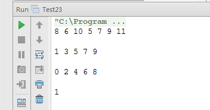

#面试题 23：从上往下打印二叉树

##题目：从上往下打印出二叉树的每个结点，同一层的结点按照从左向右的顺序打印。

###二叉树结点的定义：

```
public static class BinaryTreeNode {
    int value;
    BinaryTreeNode left;
    BinaryTreeNode right;
}
```

###解题思路：

这道题实质是考查树的遍历算法。从上到下打印二叉树的规律：每一次打印一个结点的时候，如果该结点有子结点， 则把该结点的子结点放到一个队列的末尾。接下来到队列的头部取出最早进入队列的结点，重复前面的打印操作，直至队列中所有的结点都被打印出来为止。

###代码实现：

```
public class Test23 {
    /**
     * 二叉树的树结点
     */
    public static class BinaryTreeNode {
        int value;
        BinaryTreeNode left;
        BinaryTreeNode right;
    }
    /**
     * 从上往下打印出二叉树的每个结点，向一层的结点按照从左往右的顺序打印。
     * 例如下的二叉树，
     *       8
     *    /    \
     *   6     10
     *  /  \   / \
     * 5   7  9  11
     * 则依次打印出8、6、10、5、3 、9、11.
     *
     * @param root 树的结点
     */
    public static void printFromToBottom(BinaryTreeNode root) {
        // 当结点非空时才进行操作
        if (root != null) {
            // 用于存放还未遍历的元素
            Queue<BinaryTreeNode> list = new LinkedList<>();
            // 将根结点入队
            list.add(root);
            // 用于记录当前处理的结点
            BinaryTreeNode curNode;
            // 队列非空则进行处理
            while (!list.isEmpty()) {
                // 删除队首元素
                curNode = list.remove();
                // 输出队首元素的值
                System.out.print(curNode.value + " ");
                // 如果左子结点不为空，则左子结点入队
                if (curNode.left != null) {
                    list.add(curNode.left);
                }
                // 如果右子结点不为空，则左子结点入队
                if (curNode.right != null) {
                    list.add(curNode.right);
                }
            }
        }
    }
    public static void main(String[] args) {

        //       8
        //    /    \
        //   6     10
        //  / \   / \
        // 5   7 9  11
        BinaryTreeNode root = new BinaryTreeNode();
        root.value = 8;
        root.left = new BinaryTreeNode();
        root.left.value = 6;
        root.left.left = new BinaryTreeNode();
        root.left.left.value = 5;
        root.left.right = new BinaryTreeNode();
        root.left.right.value = 7;
        root.right = new BinaryTreeNode();
        root.right.value = 10;
        root.right.left = new BinaryTreeNode();
        root.right.left.value = 9;
        root.right.right = new BinaryTreeNode();
        root.right.right.value = 11;
        printFromToBottom(root);
        //         1
        //        /
        //       3
        //      /
        //     5
        //    /
        //   7
        //  /
        // 9
        BinaryTreeNode root2 = new BinaryTreeNode();
        root2.value = 1;
        root2.left = new BinaryTreeNode();
        root2.left.value = 3;
        root2.left.left = new BinaryTreeNode();
        root2.left.left.value = 5;
        root2.left.left.left = new BinaryTreeNode();
        root2.left.left.left.value = 7;
        root2.left.left.left.left = new BinaryTreeNode();
        root2.left.left.left.left.value = 9;
        System.out.println("\n");
        printFromToBottom(root2);
        // 0
        //  \
        //   2
        //    \
        //     4
        //      \
        //       6
        //        \
        //         8
        BinaryTreeNode root3 = new BinaryTreeNode();
        root3.value = 0;
        root3.right = new BinaryTreeNode();
        root3.right.value = 2;
        root3.right.right = new BinaryTreeNode();
        root3.right.right.value = 4;
        root3.right.right.right = new BinaryTreeNode();
        root3.right.right.right.value = 6;
        root3.right.right.right.right = new BinaryTreeNode();
        root3.right.right.right.right.value = 8;
        System.out.println("\n");
        printFromToBottom(root3);
        // 1
        BinaryTreeNode root4 = new BinaryTreeNode();
        root4.value = 1;
        System.out.println("\n");
        printFromToBottom(root4);
        // null
        System.out.println("\n");
        printFromToBottom(null);

    }
}
```

###运行结果：

