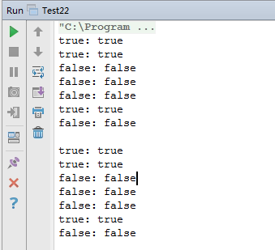

# 栈的压入、弹出序列

## 题目：输入两个整数序列，第一个序列表示栈的压入顺序，请判断二个序列是否为该栈的弹出顺序。假设压入栈的所有数字均不相等。

### 解题思路：

解决这个问题很直观的想法就是建立一个辅助栈，把输入的第一个序列中的数字依次压入该辅助栈，并按照第二个序列的顺序依次从该栈中弹出数字。

判断一个序列是不是栈的弹出序列的规律：如果下一个弹出的数字刚好是栈顶数字，那么直接弹出。如果下一个弹出的数字不在栈顶，我们把压栈序列中还没有入栈的数字压入辅助栈，直到把下一个需要弹出的数字压入栈顶为止。如果所有的数字都压入栈了仍然没有找到下一个弹出的数字，那么该序列不可能是一个弹出序列。

### 代码实现：

```
public class Test22 {
    /**
     * 输入两个整数序列，第一个序列表示栈的压入顺序，请判断二个序列是否为该栈的弹出顺序。
     * 假设压入栈的所有数字均不相等。例如序列1 、2、3 、4、5 是某栈压栈序列，
     * 序列4、5、3、2、1是该压栈序列对应的一个弹出序列，
     * 但4、3、5、1、2就不可能是该压棋序列的弹出序列。
     * 【与书本的的方法不同】
     *
     * @param push 入栈序列
     * @param pop  出栈序列
     * @return true：出栈序列是入栈序列的一个弹出顺序
     */
    public static boolean isPopOrder(int[] push, int[] pop) {
        // 输入校验，参数不能为空，并且两个数组中必须有数字，并且两个数组中的数字个数相同
        // 否则返回false
        if (push == null || pop == null || pop.length == 0 || push.length == 0 || push.length != pop.length) {
            return false;
        }
        // 经过上面的参数校验，两个数组中一定有数据，且数据数目相等
        // 用于存放入栈时的数据
        Stack<Integer> stack = new Stack<>();
        // 用于记录入栈数组元素的处理位置
        int pushIndex = 0;
        // 用于记录出栈数组元素的处理位置
        int popIndex = 0;
        // 如果还有出栈元素要处理
        while (popIndex < pop.length) {
            // 入栈元素还未全部入栈的条件下，如果栈为空，或者栈顶的元素不与当前处理的相等，则一直进行栈操作，
            // 直到入栈元素全部入栈或者找到了一个与当出栈元素相等的元素
            while (pushIndex < push.length && (stack.isEmpty() || stack.peek() != pop[popIndex])) {
                // 入栈数组中的元素入栈
                stack.push(push[pushIndex]);
                // 指向下一个要处理的入栈元素
                pushIndex++;
            }
            // 如果在上一步的入栈过程中找到了与出栈的元素相等的元素
            if (stack.peek() == pop[popIndex]) {
                // 将元素出栈
                stack.pop();
                // 处理下一个出栈元素
                popIndex++;
            }
            // 如果没有找到与出栈元素相等的元素，说明这个出栈顺序是不合法的
            // 就返回false
            else {
                return false;
            }
        }
        // 下面的语句总是成立的
        // return stack.isEmpty();
        // 为什么可以直接返回true：对上面的外层while进行分析可知道，对每一个入栈的元素，
        // 在stack栈中，通过一些入栈操作，总可以在栈顶上找到与入栈元素值相同的元素，
        // 这就说明了这个出栈的顺序是入栈顺序的一个弹出队列，这也可以解释为什么stack.isEmpty()
        // 总是返回true，所有的入栈元素都可以进栈，并且可以被匹配到，之后就弹出，最后栈中就无元素。
        return true;
    }
    /**
     * 输入两个整数序列，第一个序列表示栈的压入顺序，请判断二个序列是否为该栈的弹出顺序。
     * 【按书本上的思路进行求解，两者相差不大】
     *
     * @param push 入栈序列
     * @param pop  出栈序列
     * @return true：出栈序列是入栈序列的一个弹出顺序
     */
    public static boolean isPopOrder2(int[] push, int[] pop) {
        // 用于记录判断出栈顺序是不是入栈顺的一个出栈序列，默认false
        boolean isPossible = false;
        // 当入栈和出栈数组者都不为空，并且都有数据，并且数据个数都相等
        if (push != null && pop != null && push.length > 0 && push.length == pop.length) {
            // 用于存放入栈时的数据
            Stack<Integer> stack = new Stack<>();
            // 记录下一个要处理的入栈元素的位置
            int nextPush = 0;
            // 记录下一个要处理的出栈元素的位置
            int nextPop = 0;
            // 如果出栈元素没有处理完就继续进行处理
            while (nextPop < pop.length) {
                // 如果栈为空或者栈顶的元素与当前处理的出栈元素不相同，一直进行操作
                while (stack.isEmpty() || stack.peek() != pop[nextPop]) {
                    // 如果入栈的元素已经全部入栈了，就退出内层循环
                    if (nextPush >= push.length) {
                        break;
                    }
                    // 执行到此处说明还有入栈元素可以入栈
                    // 即将元素入栈
                    stack.push(push[nextPush]);
                    // 指向下一个要处理的入栈元素的位置
                    nextPush++;
                }
                // 执行到此处有两种情况：
                // 第一种：在栈顶上找到了一个与入栈元素相等的元素
                // 第二种：在栈顶上没有找到一个与入栈元素相等的元素，而且输入栈的元素已经全部入栈了
                // 对于第二种情况就说弹出栈的顺序是不符合要求的，退出外层循环
                if (stack.peek() != pop[nextPop]) {
                    break;
                }
                // 对应到第一种情况：需要要栈的栈顶元素弹出
                stack.pop();
                // 指向下一个要处理的出栈元素的位置
                nextPop++;
            }
            // 执行到此处有两种情况
            // 第一种：外层while循环的在第一种情况下退出，
            // 第二种：所有的出栈元素都被正确匹配
            // 对于出现的第一种情况其stack.isEmpty()必不为空，原因为分析如下：
            // 所有的入栈元素一定会入栈，但是只有匹配的情况下才会出栈，
            // 匹配的次数最多与入栈元素个数元素相同（两个数组的长度相等），如果有不匹配的元素，
            // 必然会使出栈的次数比入栈的次数少，这样栈中至少会有一个元素
            // 对于第二种情况其stack.isEmpty()一定为空
            // 所以书本上的nextPop == pop.length（pNextPop-pPop==nLength）是多余的
            if (stack.isEmpty()) {
                isPossible = true;
            }
        }
        return isPossible;
    }
    public static void main(String[] args) {
        int[] push = {1, 2, 3, 4, 5};
        int[] pop1 = {4, 5, 3, 2, 1};
        int[] pop2 = {3, 5, 4, 2, 1};
        int[] pop3 = {4, 3, 5, 1, 2};
        int[] pop4 = {3, 5, 4, 1, 2};
        System.out.println("true: " + isPopOrder(push, pop1));
        System.out.println("true: " + isPopOrder(push, pop2));
        System.out.println("false: " + isPopOrder(push, pop3));
        System.out.println("false: " + isPopOrder(push, pop4));
        int[] push5 = {1};
        int[] pop5 = {2};
        System.out.println("false: " + isPopOrder(push5, pop5));
        int[] push6 = {1};
        int[] pop6 = {1};
        System.out.println("true: " + isPopOrder(push6, pop6));
        System.out.println("false: " + isPopOrder(null, null));
        // 测试方法2
        System.out.println();
        System.out.println("true: " + isPopOrder2(push, pop1));
        System.out.println("true: " + isPopOrder2(push, pop2));
        System.out.println("false: " + isPopOrder2(push, pop3));
        System.out.println("false: " + isPopOrder2(push, pop4));
        System.out.println("false: " + isPopOrder2(push5, pop5));
        System.out.println("true: " + isPopOrder2(push6, pop6));
        System.out.println("false: " + isPopOrder2(null, null));
    }
}
```

### 运行结果：

