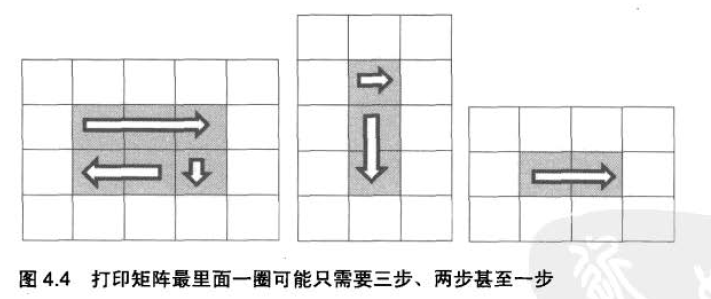

#面试题 20：顺时针打印矩阵

##题目：输入一个矩阵，按照从外向里以顺时针的顺序依次扫印出每一个数字

###解题思路：

把打印一圈分为四步：第一步从左到右打印一行，第二步从上到下打印一列，第三步从右到左打印一行，第四步从下到上打印一列。每一步我们根据起始坐标和终止坐标用一个循环就能打印出一行或者一列。

不过值得注意的是，最后一圈有可能退化成只有一行、只有一列，甚至只有一个数字，因此打印这样的一圈就不再需要四步。图 4.4 是几个退化的例子， 打印一圈分别只需要三步、两步甚至只有一步。



因此我们要仔细分析打印时每一步的前提条件。第一步总是需要的， 因为打印一圈至少有一步。如果只有一行，那么就不用第二步了。也就是需要 第二步的前提条件是终止行号大于起始行号。需要第三步打印的前提条件是圈内至少有两行两列，也就是说除了要求终止行号大于起始行号之外，还要求终止列号大于起始列号。同理，需要打印第四步的前提条件是至少有三行两列，因此要求终止行号比起始行号至少大  2， 同时终止列号大于起始列号。

###代码实现：

```
public class Test20 {
    /**
     * 输入一个矩阵，按照从外向里以顺时针的顺序依次打印每一个数字
     *
     * @param numbers 输入的二维数组，二维数组必须是N*M的，否则分出错
     */
    public static void printMatrixClockWisely(int[][] numbers) {
        // 输入的参数不能为空
        if (numbers == null) {
            return;
        }
        // 记录一圈（环）的开始位置的行
        int x = 0;
        // 记录一圈（环）的开始位置的列
        int y = 0;
        // 对每一圈（环）进行处理，
        // 行号最大是(numbers.length-1)/2
        // 列号最大是(numbers[0].length-1)/2
        while (x * 2 < numbers.length && y * 2 < numbers[0].length) {
            printMatrixInCircle(numbers, x, y);
            // 指向下一个要处理的的环的第一个位置
            x++;
            y++;
        }
    }
    public static void printMatrixInCircle(int[][] numbers, int x, int y) {
        // 数组的行数
        int rows = numbers.length;
        // 数组的列数
        int cols = numbers[0].length;

        // 输出环的上面一行，包括最中的那个数字
        for (int i = y; i <= cols - y - 1; i++) {
            System.out.print(numbers[x][i] + " ");
        }
        // 环的高度至少为2才会输出右边的一列
        // rows-x-1：表示的是环最下的那一行的行号
        if (rows - x - 1 > x) {
            // 因为右边那一列的最上面那一个已经被输出了，所以行呈从x+1开始，
            // 输出包括右边那列的最下面那个
            for (int i = x + 1; i <= rows - x - 1; i++) {
                System.out.print(numbers[i][cols - y - 1] + " ");
            }
        }
        // 环的高度至少是2并且环的宽度至少是2才会输出下面那一行
        // cols-1-y：表示的是环最右那一列的列号
        if (rows - x - 1 > x && cols - 1 - y > y) {
            // 因为环的左下角的位置已经输出了，所以列号从cols-y-2开始
            for (int i = cols - y - 2; i >= y; i--) {
                System.out.print(numbers[rows - 1 - x][i] + " ");
            }
        }
        // 环的宽度至少是2并且环的高度至少是3才会输出最左边那一列
        // rows-x-1：表示的是环最下的那一行的行号
        if (cols - 1 - y > y && rows - 1 - x > x + 1) {
            // 因为最左边那一列的第一个和最后一个已经被输出了
            for (int i = rows - 1 - x - 1; i >= x + 1; i--) {
                System.out.print(numbers[i][y] + " ");
            }
        }
    }
    public static void main(String[] args) {
        int[][] numbers = {
                {1, 2, 3, 4, 5},
                {16, 17, 18, 19, 6},
                {15, 24, 25, 20, 7},
                {14, 23, 22, 21, 8},
                {13, 12, 11, 10, 9},
        };
        printMatrixClockWisely(numbers);
        System.out.println();
        int[][] numbers2 = {
                {1, 2, 3, 4, 5, 6, 7, 8},
                {22, 23, 24, 25, 26, 27, 28, 9},
                {21, 36, 37, 38, 39, 40, 29, 10},
                {20, 35, 34, 33, 32, 31, 30, 11},
                {19, 18, 17, 16, 15, 14, 13, 12},

        };
        printMatrixClockWisely(numbers2);
        System.out.println();
        int[][] numbers3 = {
                {1, 2, 3, 4, 5, 6, 7, 8}
        };
        printMatrixClockWisely(numbers3);
        System.out.println();
        int[][] numbers4 = {
                {1, 2, 3, 4, 5, 6, 7, 8},
                {16, 15, 14, 13, 12, 11, 10, 9}
        };
        printMatrixClockWisely(numbers4);
        System.out.println();
        int[][] numbers5 = {
                {1},
                {2},
                {3},
                {4},
                {5},
                {6},
                {7},
                {8}
        };
        printMatrixClockWisely(numbers5);
        System.out.println();
        int[][] numbers6 = {
                {0, 1},
                {15, 2},
                {14, 3},
                {13, 4},
                {12, 5},
                {11, 6},
                {10, 7},
                {9, 8}
        };
        printMatrixClockWisely(numbers6);
        System.out.println();
        int[][] numbers7 = {
                {1, 2},
                {4, 3}
        };
        printMatrixClockWisely(numbers7);
        System.out.println();
        int[][] numbers8 = {
                {1}
        };
        printMatrixClockWisely(numbers8);
        System.out.println();
        // 0个元素的数组
        printMatrixClockWisely(new int[][]{{}});
        // 空数组
        printMatrixClockWisely(null);
    }
```

###运行结果

